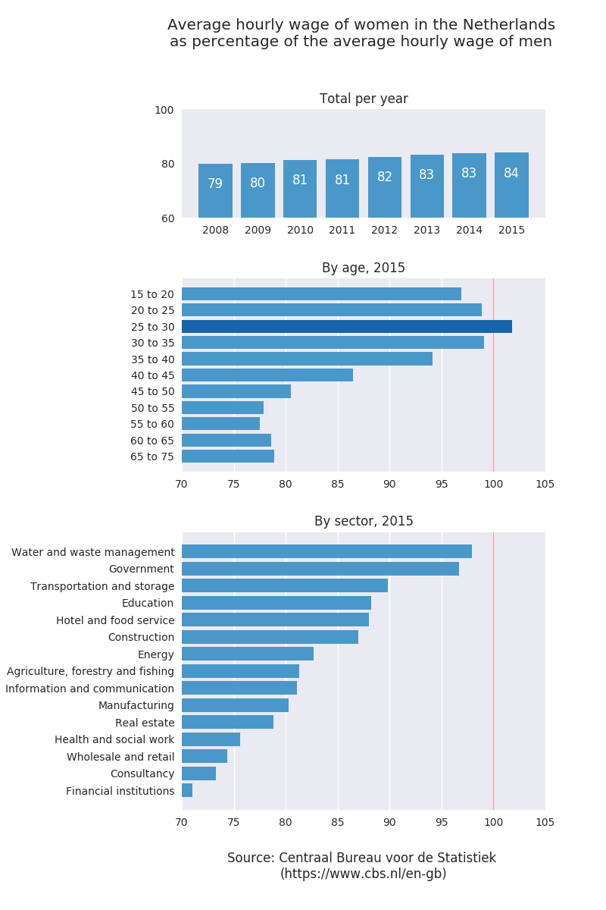

## Gender pay gap in the Netherlands ##
*Claire Pritchard*  
*October 2017*  
*Visualization created for Applied Plotting, Charting & Data Representation in Python*  
*University of Michigan / Coursera*  

#### The issue ####
According to statistics collected by the [Centraal Bureau voor de Statistiek (Statistics Netherlands)](https://www.cbs.nl/en-gb),
there is a disparity between the average hourly wage paid to men and that paid to women. Even when
accounting for differences in education level, experience, and full time vs part time work, there is
a pay gap which remains unexplained. Sectors which have made a deliberate effort to decrease inequalties
(government, for example) have a much smaller pay gap than others like the financial sector, which can
be seen in the chart.

These differences in pay are, however, steadily decreasing. The chart showing the total wage gap for
each year shows that between 2008 and 2015, the hourly wage of women compared to that of men increased
from 79% to 84%. In addition, certain age groups experience a much smaller pay gap than others, with
women between 25 and 30 earning, on average, slightly more than their male counterparts, apparently due
to higher educational levels. After 30, women earn less than men, with the disparity continuing to
increase with age.

This article (Dutch only) discusses the wage gap in more detail:
https://www.cbs.nl/nl-nl/nieuws/2016/47/krijgen-mannen-en-vrouwen-gelijk-loon-voor-gelijk-werk-

#### Gender pay gap in the Netherlands, 2008-2015 ####

#### The datasets ####
- [Pay gap male-female; characteristics (81901NED), 2008-2015](https://opendata.cbs.nl/dataportaal/portal.html?_la=nl&_catalog=CBS&tableId=81901NED&_theme=21)
- [Pay gap male-female; SBI 2008 (81920NED), 2008-2015](https://opendata.cbs.nl/dataportaal/portal.html?_la=nl&_catalog=CBS&tableId=81920NED&_theme=21)

Under Downloads, click on "Onbewerkte dataset" and then "Download CSV".Additional information (region codes, etc.) can be found in the metadata files for these datasets.